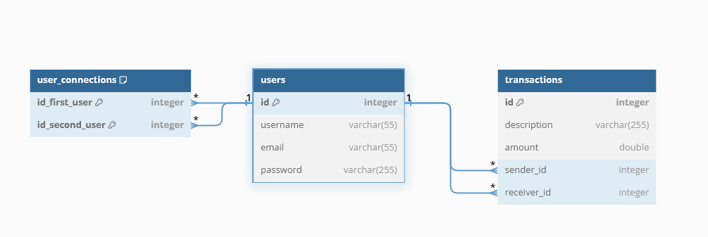

# P6-PayMyBuddy

# bdd.env
The application need a file named "bdd.env" in the project root directory, with four variables : DB_URL, DB_URL_TEST, DB_USERNAME and DB_PASSWORD

example : 

DB_URL=jdbc:mysql://localhost:3306/p6_paymybuddy?serverTimezone=UTC

DB_URL_TEST=jdbc:mysql://localhost:3306/p6_paymybuddy_test?serverTimezone=UTC

DB_USERNAME=username

DB_PASSWORD=password

# SQL
Two scripts below for the database, one for the app and the other one for testing.

[p6_paymybuddy_script.sql](sql%2Fp6_paymybuddy_script.sql)

[p6_paymybuddy_test_script.sql](sql%2Fp6_paymybuddy_test_script.sql)

# MPD
    USERS : 
    id integer (PK)
    username varchar(55)
    email varchar(55)
    password varchar(255)

    TRANSACTIONS :
    id integer (PK)
    description varchar(255)
    amount double
    sender_id integer (FK)
    receiver_id integer (FK)

    users_connections :
    (id_first_user integer, id_second_user integer) (PK)
    id_first_user integer (FK)
    id_second_user integer (FK)

# USER in Database

mail : alice@mail.com

password : pass1